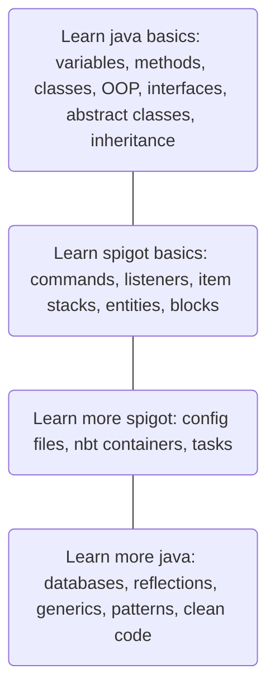

```mermaid
flowchart TD
  LEARN_JAVA_BASICS(Learn java basics: variables, methods, classes, OOP, interfaces, abstract classes, inheritance)
  LEARN_SPIGOT_BASICS(Learn spigot basics: commands, listeners, item stacks, entities, blocks)
  LEARN_MORE_SPIGOT(Learn more spigot: config files, nbt containers, tasks)
  LEARN_MORE_JAVA(Learn more java: databases, reflections, generics, patterns, clean code)

  LEARN_JAVA_BASICS --- LEARN_SPIGOT_BASICS --- LEARN_MORE_SPIGOT --- LEARN_MORE_JAVA
```
